## Project: Deep Learning - Follow Me

---


# Overview

The aim of this project was to train and use a Fully Convolutional Neural network, to allow a virtual drone to identify and follow a chosen character - the 'hero' - within a simulator. This hero would be among many other "distractor" characters, making for a good test of the ability of the network to correctly identify the object of interest.

The simulator was run in the Unity Engine, with helper code to drive the virtual drone provided by Udacity. The network model provided by the student then assessed the data coming from the simulator. As such the main focus of the project was to create a network using Keras and to attain at least a 40% global accuracy figure on tests of Intersection over Union metrics.


*Screenshot from Unity simulator showing the virtual drone following the hero character*

Aims:

* Explain each layer of the network architecture and the role that it plays in the overall network.
* Demonstrate the benefits and/or drawbacks of different network architectures pertaining to this project and justify the current network with factual data. 
* Configurable parameters should also be explained in the network architecture.
* Provide a graph, table, diagram, illustration or figure for the overall network.
* Explain what is meant by 1 by 1 convolutions and where/when/how they should be used.
* Explain the concept of a fully connected layer and where/when/how it should be used.
* Identify the use of various reasons for encoding / decoding images, when it should be used, why it is useful, and any problems that may arise.
* Articulate whether this model and data would work well for following another object (dog, cat, car, etc.) instead of a human and if not, what changes would be required.

### Section 1 - Network Architecture


Broadly speaking, a Fully Convolutional Network is a powerful type of Neural Network, capable of carrying out complex computer vision tasks such as identifying objects in an image. However, unlike a simple classifier, it is capable of showing *where* in the image the object of interest is located. 

This is a significant improvement over simpler convolutional neural nets that have, as their output, a **'fully connected layer'**. It is called fully connected because every 'neuron' in the layer is connected to every output in the preceding layer, and then uses for example a softmax activation to determine if examples of particular classes of objects that we are looking for are present within the image. As such it removes data that tells us about space, and can only answer the question "is the object present **anywhere** in the image", as opposed to "is the object present, and **where can I find it** ". 

Fully Convolutional Neural networks are able to both identify the object and identify where it is and should be used as such. It does this by replacing the fully connected layer with a 'Decoder', as illustrated below, itself built from convolutional neural nets. The input to the decoder, in keeping with this convention, then becomes the "Encoder". The decoder takes the information processed by the encoder and "blows it up" to the size of the original image. This then allows us to perform semantic segmentation on a pixel by pixel basis, for example identifying the pixels that belong to cars, traffic lights etc in the image below:

Another advantage of FCN's is that they can use images of any size, whereas a convnet with fully connected layer cannot, due to the mechanics of matrix multiplication involved in each.

A disadvantage of the FCN Encoder / Decoder model is that the extensive use of convolutions leads to longer model training times. Use of very deep models may use up large amounts of memory, and if skip connections are used to ensure no loss of coarser grained data, its possible for model size to become prohibitively large.


*Picture credit: towardsdatascience.com*

 

### Architecture Diagram

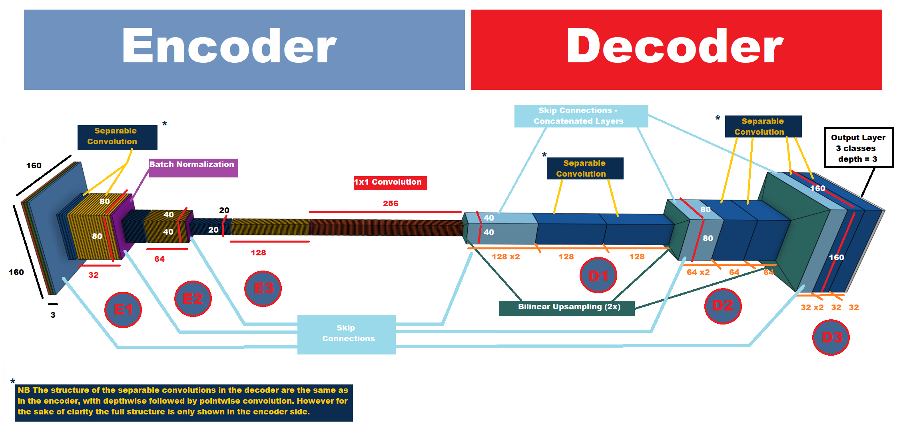
*Image produced using OnShape CAD and MSPaint for captions*


```python
def fcn_model(inputs, num_classes):
    
    # TODO Add Encoder Blocks. 
    # Remember that with each encoder layer, the depth of your model (the number of filters) increases.
    # TODO Add 1x1 Convolution layer using conv2d_batchnorm().   
    # TODO: Add the same number of Decoder Blocks as the number of Encoder Blocks
    
# ENCODER BLOCK 1
    # This calls the encoder_block function and passes a depth of 32 and strides of 2. It passes the previous 
    # layer as input, in this case the input layer.
    E_layer1 = encoder_block(inputs, 32, 2) 
    
# ENCODER BLOCK 2
    # Format of arguments is as above, except this time the input is the output of the preceding layer.
    E_layer2 = encoder_block(E_layer1, 64, 2)            
    E_layer3 = encoder_block(E_layer2, 128, 2)  
    
# TODO Add 1x1 Convolution layer using conv2d_batchnorm().
    # This calls the Keras regular convolution function, passing the output of encoder 3, a depth of 256 and,
    # in order to make it a 1x1 covolution, a kernel size of 1 and a stride of 1.
    one_layer = conv2d_batchnorm(E_layer3, filters=256, kernel_size=1, strides=1)   
    
# TODO: Add the same number of Decoder Blocks as the number of Encoder Blocks
    # Here we pass the upsampled layer, a skip connection to a previous encoder output, and a filter depth)
    D_layer1 = decoder_block(one_layer, E_layer2, 128)         
    D_layer2 = decoder_block(D_layer1, E_layer1, 64)
    x = decoder_block(D_layer2, inputs, 32) 
   
    # The function returns the output layer of your model. "x" is the final layer obtained from the last decoder_block()
    return layers.Conv2D(num_classes, 1, activation='softmax', padding='same')(x)
```

In the diagram above, you can see that the network is split into the aforementioned encoder and decoder. Lets take a deeper look at the two sides in a bit more detail.

# Encoder


```python
def encoder_block(input_layer, filters, strides):
    
    # TODO Create a separable convolution layer using the separable_conv2d_batchnorm() function.
    output_layer = separable_conv2d_batchnorm(input_layer, filters=filters, strides=strides)
    return output_layer
```

**Input:** On the leftmost side of the network is the input. In this case it is a 160(H) x 160(W) x 3 channel image, either one of the RGB images from the simulator or a 3 channel mask from the simulator (hero, crowd member, background). The images and masks are fed in batches to the network via a helper function called BatchIteratorSimple(), which first checks that the images and masks folders are not empty, and then creates a batch list based on the batch size we pass to it. This batch size is one of the hyperparameters we can tune later.

**Separable Convolution Layers (E1 [80 x 80 x 32], E2 [40 x 40 x 64], E3 [20 x 20 x 128]):** A Separable convolution is a special type of convolutional network that has some excellent properties for deep learning. Used as part of the Xception model, which up until recently held some of the records for machine learning achievements, it is highly computationally efficient whilst also being extremely accurate. It accomplishes the former by reducing the number of parameters within the layer.

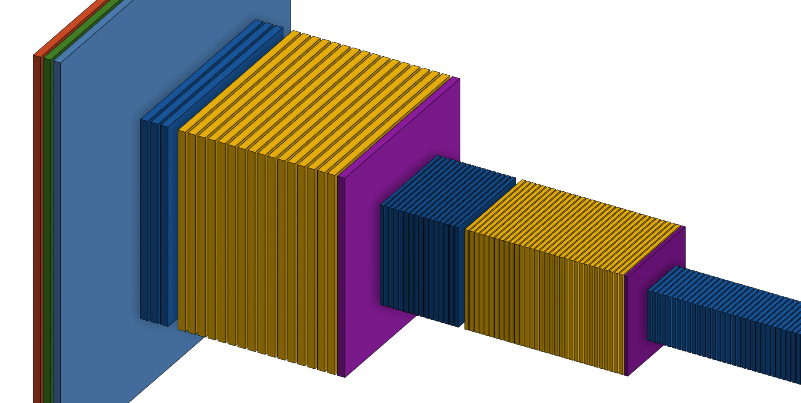

Lets use the first decoder block above as an example. Firstly the separable convolution uses a 2x2 kernel to produce a spatial convolution over each of the three (RGB) layers of the input, resulting in a further 3 layers (blue layers) but downsampled to 80x80. Then the next step of the separable convolution is to use 1x1 convolutions, which operate depthwise (across the same pixel on each layer). The depth of the output of this part of the process (yellow) is driven by the 'filters' parameter we pass to the Keras Conv2d function (see below), which for the first layer in my network was 32.


```python
def separable_conv2d_batchnorm(input_layer, filters, strides=1):
    # Separable Convolution
    output_layer = SeparableConv2DKeras(filters=filters,kernel_size=3, strides=strides,
                             padding='same', activation='relu')(input_layer)
    # Batch Normalization
    output_layer = layers.BatchNormalization()(output_layer) 
    return output_layer
```

The reduction of parameters is hugely beneficial in processing power required and the speed of computations. 

The input shape is 160x160x3. With regular convolutions we might have  say, the desired number of 32 filters (kernels) of shape 3x3x3. In the regular convolutions, the RGB input channels of the images are traversed by the 32 kernels. Without including biases, this would result in a total of 32x3x3x3 features. When we work all that out we get 854 parameters.

In case of the separable convolutions, the 3 input channels get traversed with 1 kernel each. That gives us 27 parameters (3*3*3) and 3 feature maps. In the next step, these 3 feature maps get traversed by 32 1x1 convolutions each. That results in a total of 96 (32*3) parameters. That's a total of 123 (27 + 96) parameters. Way less than the 854 parameters we got above. And as the size of the layers or channels increases, the difference will be more noticeable. 

The maths for the separable convolution works out quite differently. If we traverse each of the 3 input channels with 1 kernel each, we will get 27 parameters - 3x3x3. Then our 1x1 convolutions will traverse these 3 feature maps, and give us 96 parameters. Add this to the others and we get 123. The reduction from 854 thus has a huge impact on the processing speed of the network, yet still provides excellent results.

The separable convolution layers extract fine grained details at first from the image, and gradually build them into more complex shapes which are the features we wish to locate. The final step of the separable convolution is the relu activation, which has the advantage of being cheap to compute.

The doubling-per-encoder-layer approach for the depth was used as it is commonly found in other online observed deep learning applications. Additionally as each layer halves spatially, doubling the depth means that the number of paremeters is preserved between encoder layers. Other approaches - halving per layer, or same-per-layer, lead to a diverging validation loss.

**Batch Normalization Layer**

The batch normalization layer has a number of advantages. It makes the network train more quickly and effectively and makes it easier to find good hyperparameters. It normalises the inputs of each layer so that they have a mean output activation of zero and standard deviation of one.

**1x1 Convolution (20 x 20 x 256)**

The 1x1 convolution has a number of advantages. It is equivalent to adding a "mini neural network" over each pixel of output from the preceding layer. It is a very computationally inexpensive way of adding more learning parameters and making the network deeper. They also do not change the structure of the network, making them ideal to place between the encoder and decoder.

Again I chose a doubling of the filter depth. This yielded better results during the lab and so I retained it, however one noted advantage to 1x1 convolutions is the potential for reduced paramater numbers by reducing the number of filters in the layer e.g. reducing a 20x20x128 input to a 20x20x64 output. In my case the 1x1 layer simply adds extra inexpensive weight tuning.

The code for the 1x1 is below - a regular convolution layer with kernel size of 1 and stride of 1 so that the output spatial dimensions match the upsampled dimensions.

For the sake of simplicity, the batch normalization layer is not included in the physical model above.


```python
def conv2d_batchnorm(input_layer, filters, kernel_size=1, strides=1):
    output_layer = layers.Conv2D(filters=filters, kernel_size=kernel_size, strides=strides, 
                      padding='same', activation='relu')(input_layer)
    
    output_layer = layers.BatchNormalization()(output_layer) 
    return output_layer
```

# Decoder

The decoder is made up of three identical decoder layers. I decided to stick with the provided classroom code template for each decoder, which includes a bilinear upsampling layer, followed by a concatenated layer. The first decoder layer concatenates the output of Encoder 3 with the first upsampled layer along the "depth" axis. This is then followed by two separable convolutions, which have a kernel size of 3, same padding and stride of 1, again preserving the spatial dimensions. The role of the encoder is to identify the objects in the image. The role of the decoder is to provide ever increasing detail of where exactly in the image those objects are so that the boundary of each object, mentioned above, can be accurately generated.


```python
def decoder_block(small_ip_layer, large_ip_layer, filters):
    
    # TODO Upsample the small input layer using the bilinear_upsample() function.
    upsampled_layer = bilinear_upsample(small_ip_layer)
    # TODO Concatenate the upsampled and large input layers using layers.concatenate
    output_layer = layers.concatenate([upsampled_layer, large_ip_layer])
    # TODO Add some number of separable convolution layers. Note the kernel size is set within the 
    # SeparableConv2dKeras function
    output_layer = encoder_block(output_layer, filters=filters, strides=1)
    output_layer = encoder_block(output_layer, filters=filters, strides=1)
    
    return output_layer
```

**Bilinear Upsampling Layer** Up to now, the network has done the job of learning from the input data, however it is now heavily downsampled and an eigth of the desired size, required to carry out semantic segmentation. Bilinear Upsampling is a simple way of upscaling the layers, which it achieves with a form of interpolation between 'known' weights. Like the downsampling of the separable convnets in the encoders, the upsampling is performed with a factor of 2, stepping up from 20x20 in the 1x1 layer, to 40x40, to 80x80 and to 160x160.

**Concatenated Layer** As mentioned above, this layer is the concatenation, along the depth axis, of the output from the upsampled previous layer, and a skip layer connection from one of the preceding encoder outputs. One downside to convolutional nets is that, in identifying the important details, the "bigger picture" can be lost on subsequent passes through the network. By using a skip connection, the broader overall picture is retained allowing for more accurate segmentation. I have used skip connections between all layers mainly to simplify the code, however I may have achieved better results by adding them between select layers. This is something I could try in the future


**Separable Convolutions** Each decoder has two separable convolutions. Again the aim here is to provide finer and finer detail on which pixels belong to which object in the image. The dimensions remain the same as each respective upsample due to same padding, stride of one and a kernel size of 3. This seemed to be the most effective kernel size as going over it seemed to reduce the overall score.

**Output layer:** The final layer features a softmax activation in order to classify the outputs into 3 classes, which are hero, non-hero character and background. 

# Section 2 - Hyperparameters, Training and Results

The values which I used for the final submission, which attained a result of just under 43%, are listed below:
learning_rate = 0.004
batch_size = 40
num_epochs = 100
steps_per_epoch = 100
validation_steps = 50
workers = 3
I arrived at these parameters primarily by experimentation. In general the parameter which had the greatest impact was the learning rate (essentially the amount each weight is able to update itself on each iteration through the network). Our network includes batch normalization, which tends to allow for a wider range of effective hyperparameters. Though reasonable results were obtained with higher learning rates, they did not reach the required 40% cutoff. Once I experimented in the 10e-3 range, I started to see final IoU scores over 40.

**Results table using a learning rate of 0.003 amd same other parameters as above**
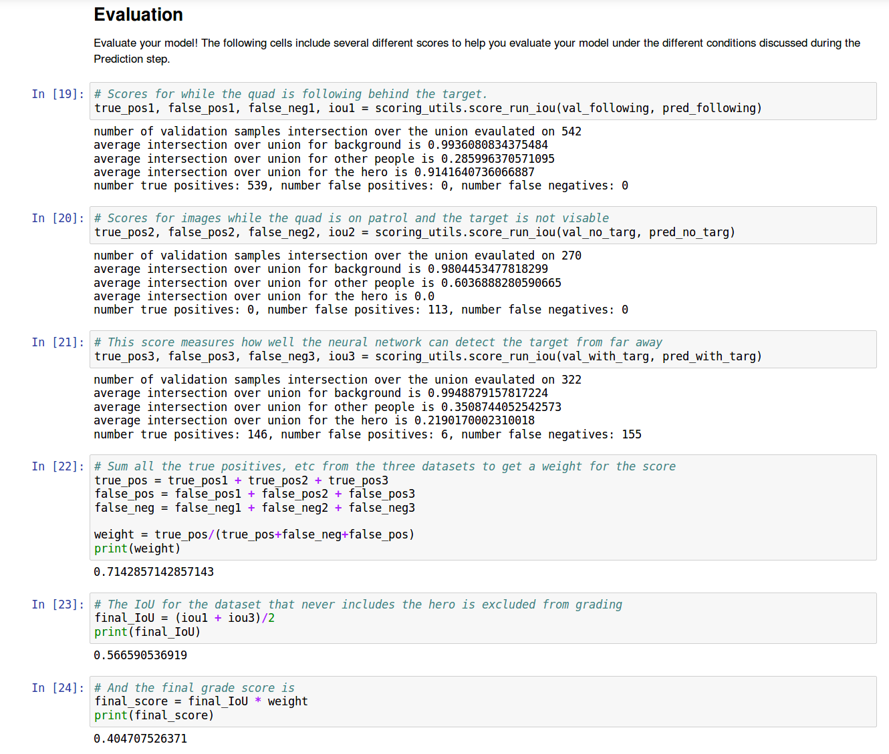

**Results table with learning rate of 0.004**
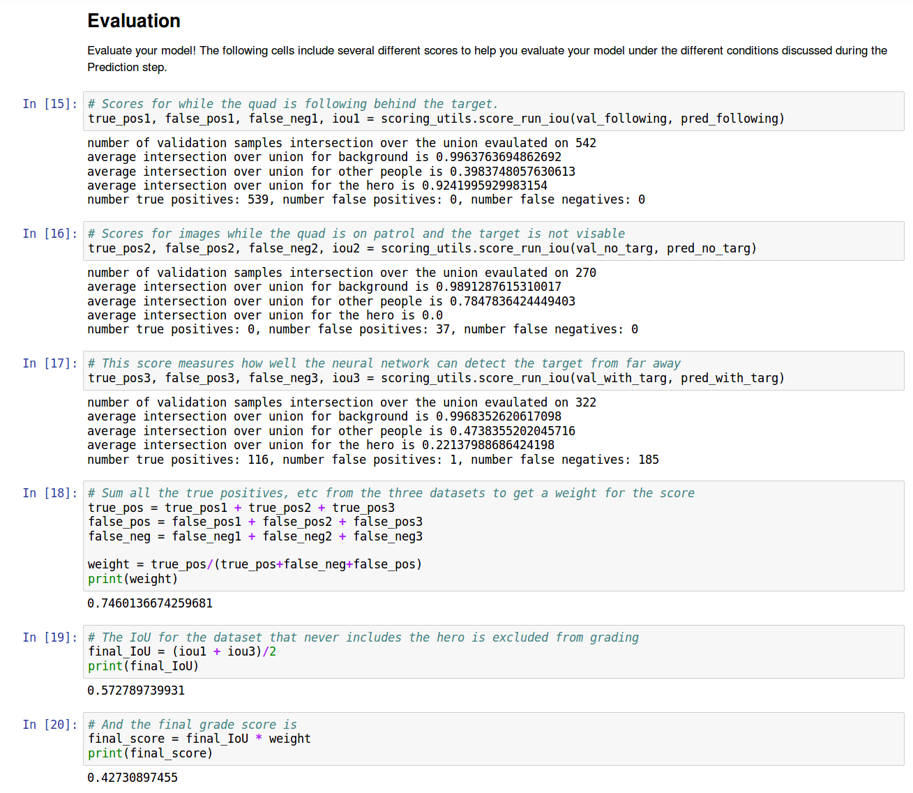

Increasing **batch size** past 42 caused me to experience out of memory errors when using my GPU (Nvidia 980 with 4GB RAM). I found an interesting, non-intuitive interaction of batch size with the **steps per epoch**. A general rule when choosing batch size and steps per epoch (as well as validation steps, which performs a similar task to steps per epoch but for validation data) is to divide your total training images by the batch size. In the standard set there are 8262 (regular images plus masks), and in the validation set there are 2368. using this division method is in order to ensure that the full set of training images is propagated through the network in one full epoch.

However I found that this did not work as well as when I, by chance, used half that number. My most successful set is with the numbers above, which when multiplied up gives 4000 for training images and 2000 for validation images. I suspect this may be due to overfitting, evidenced by a slowly diverging validation loss, possibly caused by overcapacity in the network. One future experiment may be to create a more compact network, either with fewer encoder / decoder layers or with shallower depths per layer. Another option would be to add some extra regularization such as L1 or L2.

**Results when using larger steps per epoch and hence mathematically full image set per epoch**
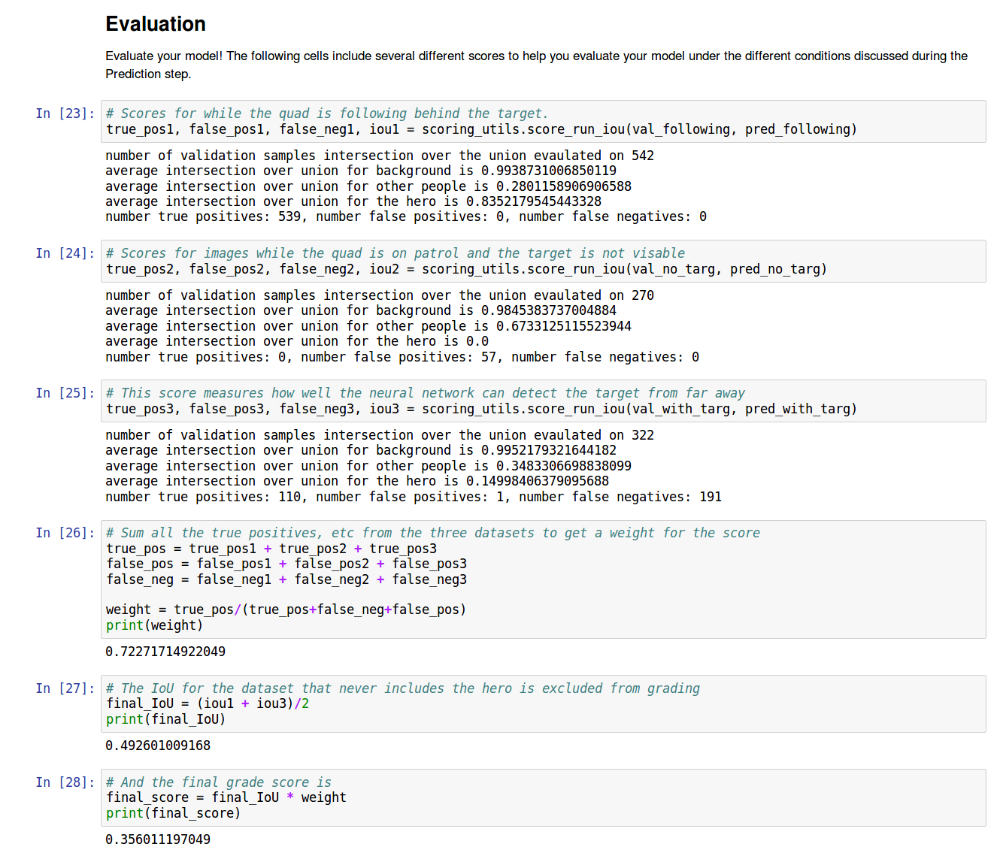

**Number of Epochs** was again arrived at through experimentation. For my three encoder / three decoder network, I found that a low number of epochs (15, 25, 50) did not allow me to reach the cutoff of 40%. Once I began looking in the 100 epoch range, the figure eventually, alongside tweaking the learning rate, reached 42.7%. The validation loss and training loss continued on a downward trend, the former indicating that this particular combination did not suffer from overfitting:

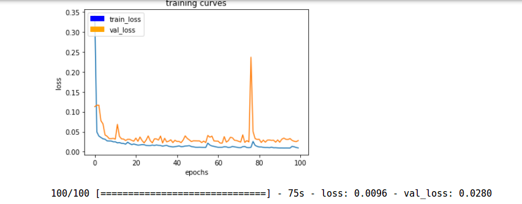

Experimentation with worker number did not appear to have much effect and it relates to the number of parallel threads running. As I have a fairly powerful GPU I decided to just increase the number by one over default. The processing time appeared to be most heavily impacted by batch size and so mostly I left worker number alone.

The results tables suggest that improvements could be made in respects to identifiying non-hero characters, and especially when identifying the hero from far away. In order to remedy the latter I experimented with acquiring further training data (see below) with the hero at the limits of the drone's camera. However even with around 200 extra images, I saw only limited improvement, and in some cases I also saw severe validation divergence. This may have been due to a mistake on my behalf, however as I was already over the cutoff requirement I decided to go with the standard, supplied set.

**Image taken of physical setup for acquiring data "at distance"**


### Difference between test ouputs for low scoring network vs high scoring network:*

**Network scoring 35% Overall. See images for titles**

When the drone is following the target, identification is very good and the network identifies the majority of the correct pixels as belonging to the hero. There appear to be some false positives for "not hero", as you can see by the sign which has been coloured green.

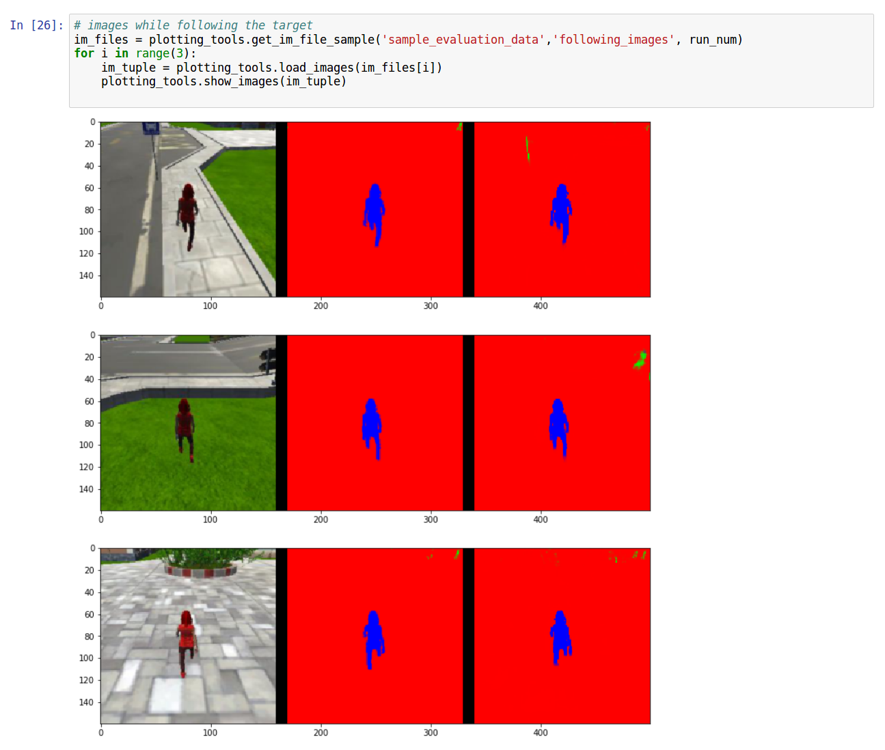

At distance, we see the greatest weaknesses. The network fails to pick up the hero when it is at the limits of the cameras range. There is also a difficulty in one of the images to identify all of the pixels belonging to the hero even at close range.

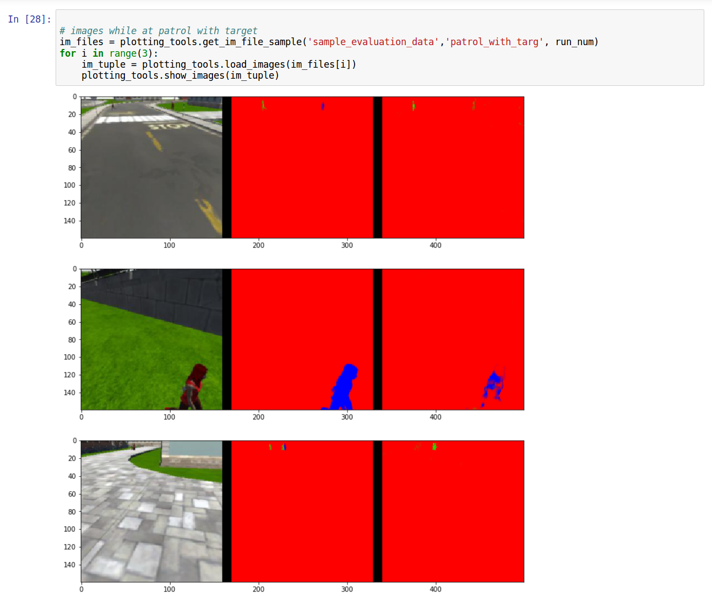

With no hero present, we again some some difficulty properly segmenting the non-hero character pixels, as seen by the holes in the image.

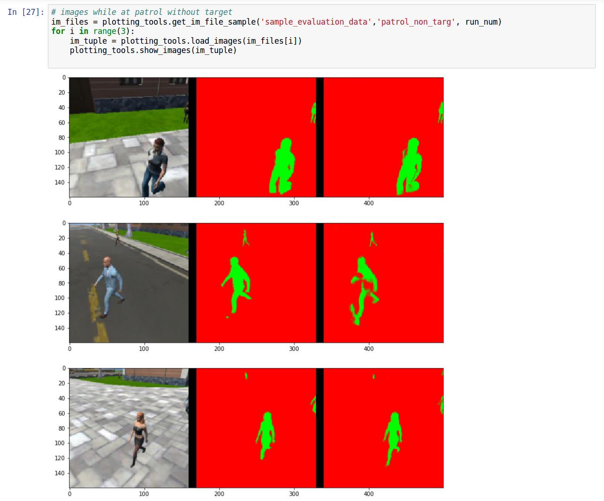

**Network scoring ~43% overall**

These are the images from my submitted model. When following the hero, the vast majority of the correct pixels are identified as belonging to the hero. There are no obvious holes in the centre of the image, though some pixels may have been lost around the feet.

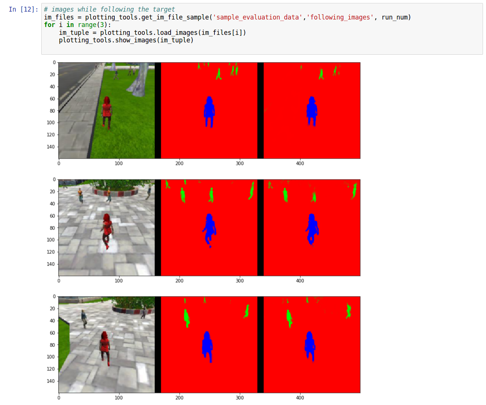

Distance is still the major weakness for this network. We can see that in some cases the hero is not captured when far away at all, though the performance is slightly better than our "35%" network. This could possibly be improved with supplementary data with the hero at distance, which I did experiment unsuccessfully with. As seen in the results table of fiures above for the 43% network, there is a very high incidence of false negatives (times when the hero was present but not captured), so this is the area for greatest improvement in the model. Indeed when the drone finds the hero during follow me testing, it is usually from a closer distance (see video)

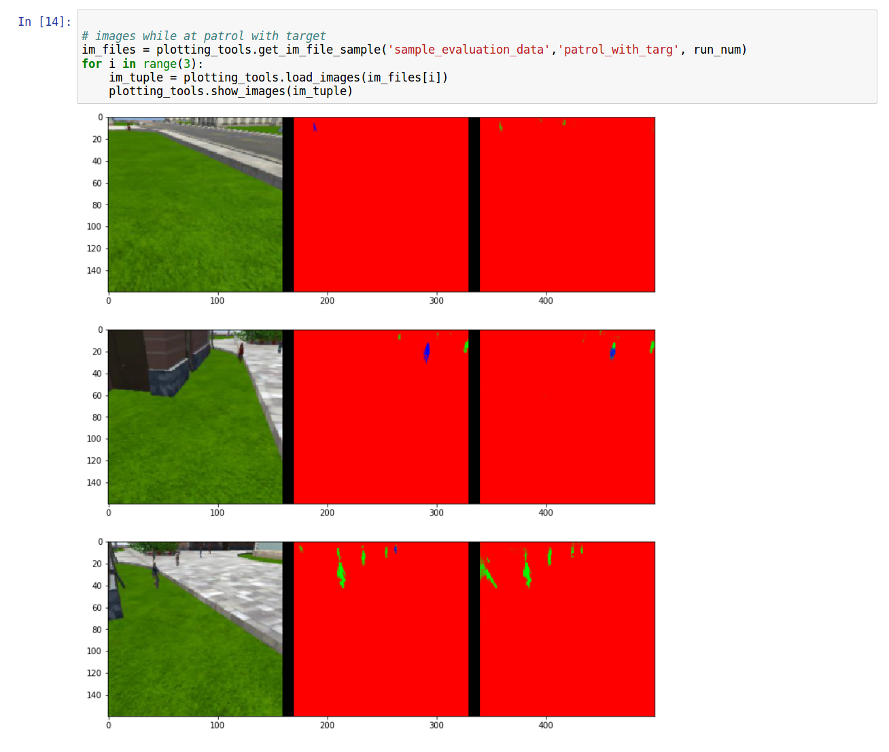

The patrol without target images were acceptable, but also could be improved. There are some unusual artefacts, such as the 'hat' being worn by one of the non-hero characters below. It has correctly found the pixels that belong to the character, but added a few as well. It also exhibits some false negatives, missing non-hero characters at distance. Again this could be improved with additional "at distance" data.

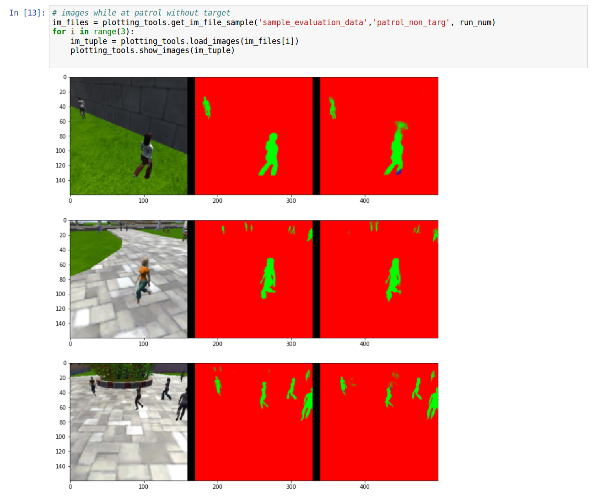

**Video of Follow Me Function in action**

For a video of the network model working with the simulator, please click here https://www.youtube.com/watch?v=q7P5_LpT-6M&t=4s

The drone finds the hero at the second opportunity, which is when their paths meet. Due primarily to the poor performance at distance, the drone does not spot the hero when she is first visible, just beyond the tree at around the 0:36 mark (not visible in video). Once the drone has found the target, it robustly tracks it during interactions with other crowd members and when the hero turns corners.

### Section 3 - Applicability of the Network and Data to other Follow Me tasks

* Would this model and data would work well for following another object (dog, cat, car, etc.) instead of a human

* What changes would be required?

This is an interesting question. In order to have any neural network function well, we need to train it on good quality data that is representative of the task it will be required to do. In this case, you would need to create new images and masks that include dogs, cats, cars etc in order to identify those objects.

Some research papers (https://arxiv.org/pdf/1611.08986.pdf) have suggested that the performance of Fully Convolutional Neural Netorks drops off on smaller sized objects due to the inbuilt downsampling of information. Using higher resolution imagery can help, as can the above mentioned paper's use of IFCN, which contains a "context network, which is a densely branched convolution network". So if using the model to find small objects like cats, some of these modifications may be required.

### Section 4 - Future Enhancements

**Encoder**

We could use a max pooling layer before the batch normalization, which is useful to prevent overfitting and further downsample the image, as well as providing a degree of translation invariance. I chose not to, in order to see how far I could get with the more "stock" classroom example. We are also already accomplishing quite marked downsampling with our separable convolutional layers.

We might also have used some regularization such as L1 / L2 or dropout, however these can lead to higher computational overheads and in any case, batch normalization has some regularization effects. It may still have been useful to apply further regularization in the event of overfitting. As noted, batch sizes had an impact on the vildation loss diverging, so an alternative might have been to try using a simpler model with less capacity and adding regularization or dropout.

**1x1 Convolution** It should be noted that the network will work without the 1x1 convolution, but including it allows the addition of extra, extremely compute-inexpensive, extra parameters.

**Decoder**

A possible alternative to using bilinear upsample / convolution is to use *Transpose Convolutions*, sometimes known as 'deconvolutions'. These have the benefit of performing both upscaling and weights training in the same layer, however they are prone to creating artifacts and 'checkerboarding' which affect the final result.
